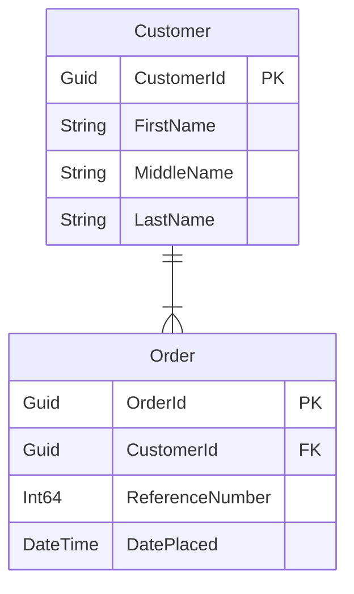

# Siren

[](https://github.com/gman-au/siren/actions/workflows/nuget.yml)


## Summary
It is a simple command line tool that can be installed from NuGet.
When run, it will take a C# assembly of POCOs / domain objects, and create an entity relationship (ER) diagram in [Mermaid syntax](https://github.com/mermaid-js/mermaid).
Properties with the `[Key]` and `[ForeignKey]` data annotations will be also marked accordingly.

## Usage
### Installation
You can install the `siren-gen` tool via the following .NET command
```
dotnet tool install -g Gman.Siren
```
### Running the tool
The tool takes two arguments with an optional third:
```
siren-gen <PATH_TO_POCO_ASSEMBLY> <PATH_TO_OUTPUT_MARKDOWN_FILE> <MARKDOWN_ANCHOR>
```
- `PATH_TO_POCO_ASSEMBLY` - this will be the location of the built .NET DLL containing the domain objects you wish to map to an ER diagram. Ideally the POCO objects would be in their own assembly.
- `PATH_TO_OUTPUT_MARKDOWN_FILE` - this points to a file (on your local file system) where the markdown should be generated; includes the full file name. The file _does not have to be a markdown_ (`.md`) file.
- `MARKDOWN_ANCHOR` - this is useful for updating `README.md` files that may be associated with your domain model (i.e. committed in a git repository). If the markdown anchor is specified, and the output file contains that markdown anchor (for example `"### My Domain Model Diagram"`), then the Siren tool will only add or replace any __existing__ diagram it finds under that anchor, and leave the rest of the document unmodified.

## Example
Take the following classes
```
public class Customer
{
	[Key]
	public Guid CustomerId { get; set; }

	public string FirstName { get; set; }

	public string MiddleName { get; set; }

	public string LastName { get; set; }
}

public class Order
{
	[Key]
	public Guid OrderId { get; set; }

	[ForeignKey("CustomerReference")]
	public Guid CustomerId { get; set; }

	public virtual Customer CustomerReference { get; set; }

	public long ReferenceNumber { get; set; }

	public DateTime DatePlaced { get; set; }
}
```
When running the tool, the output file should produce the following:

